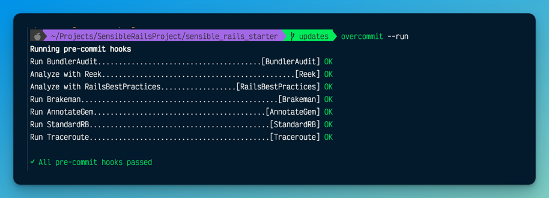

<details open="">
  <summary></summary>

<div align="center" dir="auto">
  <h1>SensibleRails</h1>
<a target="_blank" rel="noopener noreferrer" href="https://github.com/davidteren/sensible_rails_starter"></a>

<p>🚀 Focus on building stuff and not the setup. 🚀</p>
<br>
<hr>
</div>
</details>

<details open="">
  <summary><h2 align="center" dir="auto">Builds</h2></summary>

<div align="center" dir="auto">

>  [](https://ruby.ci/)
>
> _We highly recommend [RubyCI](https://ruby.ci/) for builds_
> 
> 
  


</details>

--- 

<details open="">
  <summary><h2>TOC</h2></summary>


<ol>
<li><a href="#builds">Builds</a></li>
<li><a href="#getting-started">Getting Started</a></li>
<li><a href="#using-overcommit">Using Overcommit</a></li>
<li><a href="#whats-in-the-box">What's in the box</a></li>
<li><a href="#alternatives">Alternatives</a></li>
<li><a href="#contributions">Contributions</a></li>
</ol>

<hr>

</details>


## Getting Started

- Click the [**_Use this template_**](https://github.com/davidteren/sensible_rails_starter/generate) button to create a
  clone of this repo in your Github account.
- Once you've git cloned your repo to your computer, run the following;

```bash
cd <app_name>
./bin/respawn
```

Then run the following to start the application.

```bash
./bin/dev
```

 ---

## Using overcommit

[overcommit](https://github.com/sds/overcommit) a fully configurable and extendable Git hook manager is included.
When enabled the hooks will run each time a git commit is made. If any of the checks fail the commit will be ignored and
the erros will be shown.

Enable overcommit

```bash
 overcommit --sign && overcommit --sign pre-commit
````

Run overcommit

```bash
 overcommit --run
````

You should see the following


The above pre commit hooks have been defined in [.overcommit.yml](.overcommit.yml)

---

## What's in the box

> _"Good frameworks are extracted, not invented"_ - David Heinemeier Hansson

The Gemfile is annotated with the description and links to each Gem's homepage for further details.
  
---

## Alternatives

[See a list of alternative Rails 7 templates here](docs/sensibles/alternatives.md)

---

## Contributions

Contributions welcome 🤗

> Contributions aligning with the project vision are welcome.

---
